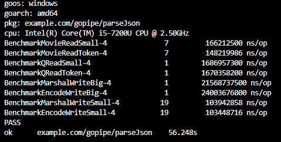

# GO JSON Read & Write

## JSON Read 

movie.json: 3MB

question.json: 54MB

### Unmarshal

### Decoder 
Decoder is better than Unmarshal for large files.

## JSON Write

encode_big.json:   597MB

encode_small.json:   6MB

## Benchmark Test

go test -bench=.

## Feedback

Please drop a note to BrianSu2004@hotmail.com for any guides, suggestions, recommendations, ideas, and comments etc. Thanks!
