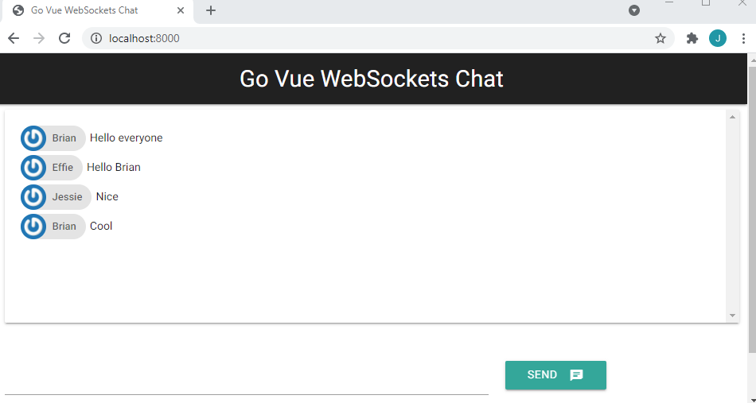

# Go Vue WebSockets Chat App

- [Build](#build)
- [Containerization](#containerization)
- [Docker Hub](#docker-hub)
- [Chat](#chat)

A simple chat web app written in Go, Vue, and WebSockets.

## Build

```dos
cd ./src
go mod tidy
go run .
```

## Containerization

```dos
call docker_build.bat
call docker_run.bat
```

## Docker Hub

```dos
docker tag websockets-go-vue-chat:latest briansu2004/websockets-go-vue-chat:latest

docker push briansu2004/websockets-go-vue-chat:latest

docker pull briansu2004/websockets-go-vue-chat:latest

(later)
docker run -it --rm -p 8000:8000 briansu2004/websockets-go-vue-chat:latest
```

## Chat

http://localhost:8000


