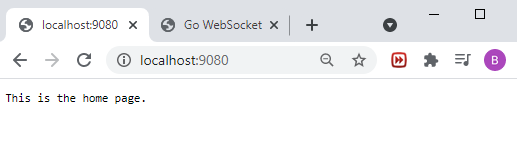
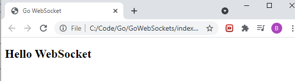
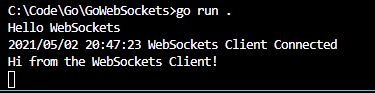
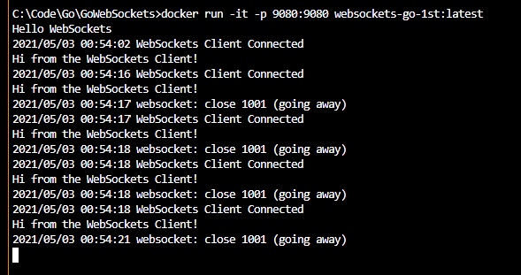
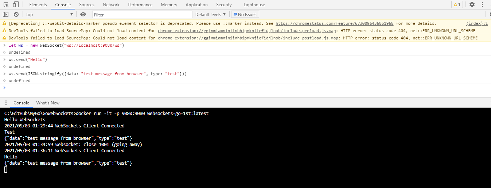

# Go WebSockets

## Build

```dos
go mod tidy

go run main.go
```

http://localhost:9080/



start client_local.html





## Containerization

```dos
call docker_build.bat
call docker_run.bat
```



## Docker Hub

```dos
docker tag websockets-go-1st:latest briansu2004/websockets-go-1st:latest

docker push briansu2004/websockets-go-1st:latest

docker pull briansu2004/websockets-go-1st:latest

(later)
docker run -it --rm -p 9080:9080 briansu2004/websockets-go-1st:latest
```

## Chrome DevTools

```dos
let ws = new WebSocket("ws://localhost:9080/ws")

ws.send("Nice")

ws.send(JSON.stringify({data: "test mssage", type: "test"}))
```


