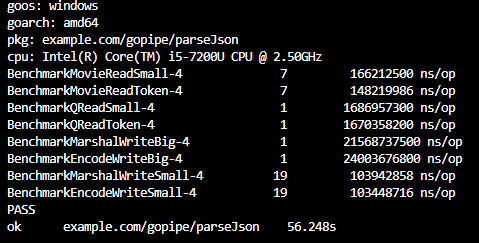

# JSON Read 

movie.json: 3MB

question.json: 54MB

## Unmarshal

## Decoder 
Decoder is better than Unmarshal for large files.

# JSON Write

big_encode.json:   597MB

small_encode.json:   6MB

# Benchmark Test

go test -bench=.

